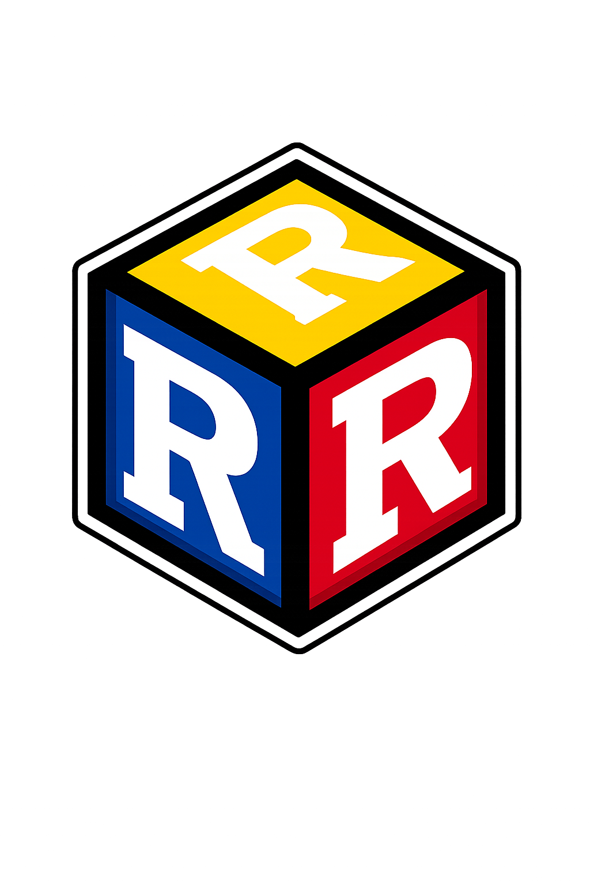
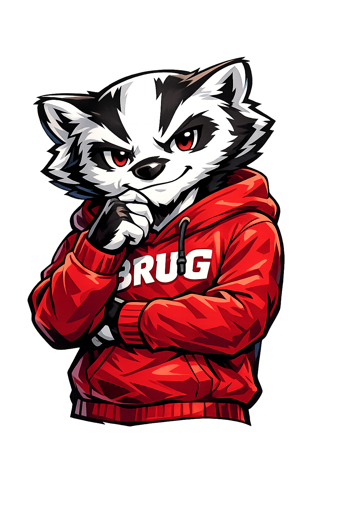

BRUG — the Badger R Users Group — is a community of practice for researchers, 
scientists, and students who code in R at UW–Madison. We are grounded in the 
Wisconsin Idea: start on campus, remain open, propagate outward.

## What we do

We give R users a place to share tools, strategies, victories, and woes — and 
to find help. In practice that means in-person meetups with tutorials, talks, 
and workflow demonstrations; a mailing list and chat workspace for ongoing 
conversation; and The Burrows, this site, where members can contribute 
resources directly via pull request. Contributing to the site is itself a 
small demonstration of the reproducible workflow BRUG is built around.

## Our logo

The R³ die — *R in Reproducible Research* — is an isometric die with an R on 
each face. Three faces, three commitments: to the language, to 
reproducibility, and to research that others can build on.

{width=150px
fig-alt="A die with a capital letter R on each of the three visibles sides"
style="float:right; margin-left: 2rem; margin-bottom: 1rem;"}

## Our mascot

Bitsey the Reproducible Badger is BRUG's mascot — an anime-inspired distant 
cousin of Bucky, equally at home in a terminal as on a football field. Bitsey 
shows up wearing a BRUG hoodie and an expression that suggests your code 
could stand to be a little more reproducible.

<!-- {width=180px -->
<!-- fig-alt="Bitsey the Reproducible Badger — an anime-style badger in a red BRUG hoodie, arms crossed" -->
<!-- style="float:right; margin-left: 2rem; margin-bottom: 1rem;"} -->

## Who we are for

Anyone who writes R code at UW–Madison — graduate students, postdocs, faculty, 
staff researchers, and undergraduates. No experience level required. BRUG 
begins on campus but remains open and useful beyond university boundaries, 
consistent with the Wisconsin Idea that education should propagate outward 
into the world.